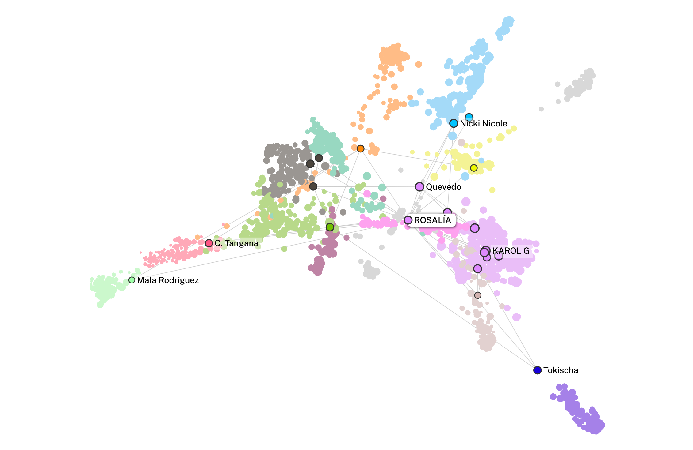

# Visualizaciones PEC2

## Diagrama de Red

Para ver el diagrama de red, haz clic en el siguiente enlace:

[Ver Diagrama de Red](https://ouestware.gitlab.io/retina/beta/#/graph/?url=https%3A%2F%2Fgist.githubusercontent.com%2FCGD2401%2Fe453f89d756fafb3f14f968e08316e9e%2Fraw%2F59eea47e1381b8c1ca3ed788b85be6fadb47c41e%2Fnetwork-3b35c617-76c.gexf&n=7ltDVBr6mKbRvohxheJ9h1&nr=0.723&er=1.085&lt=1.38)

Este enlace llevará a un diagrama de red interactivo que se muestra en Retina.

---
