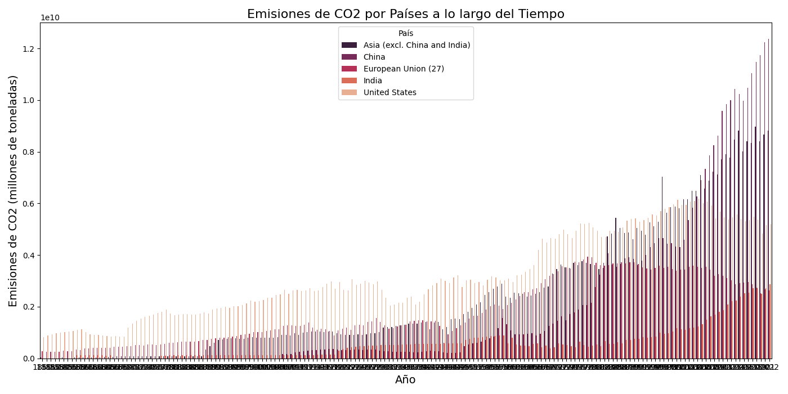
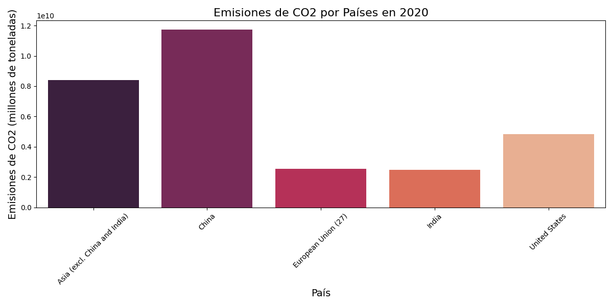
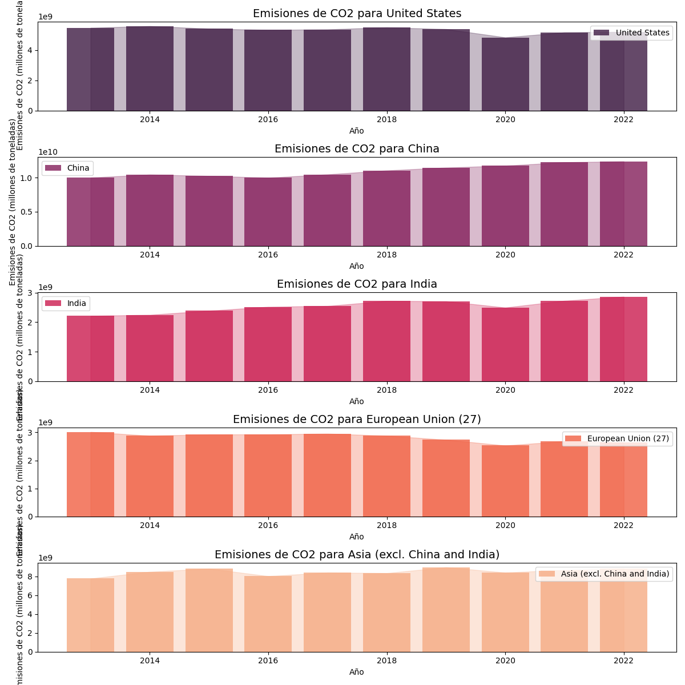
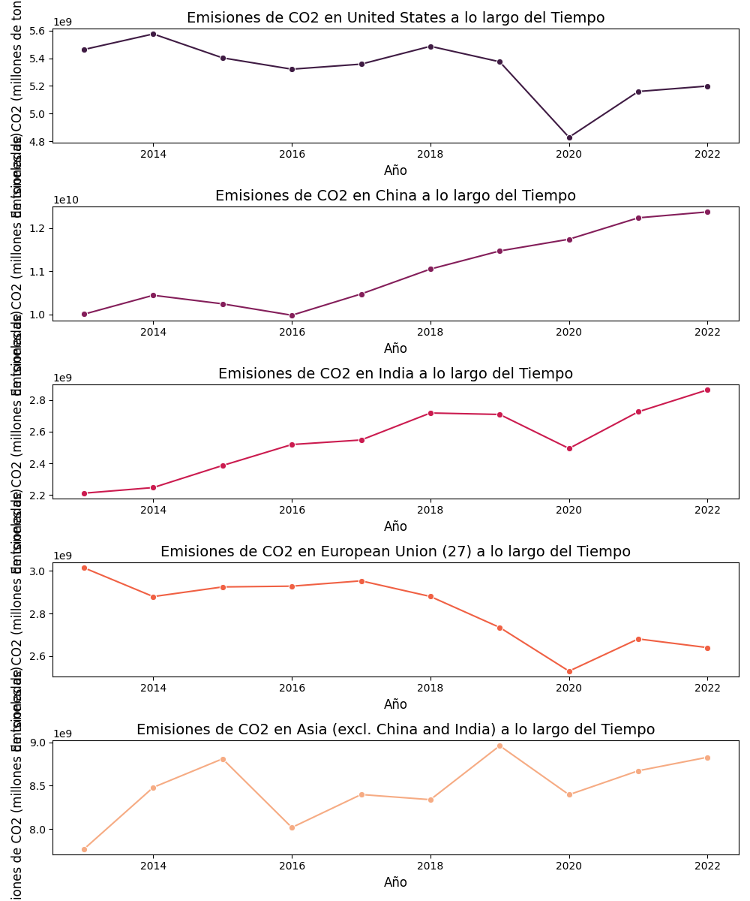
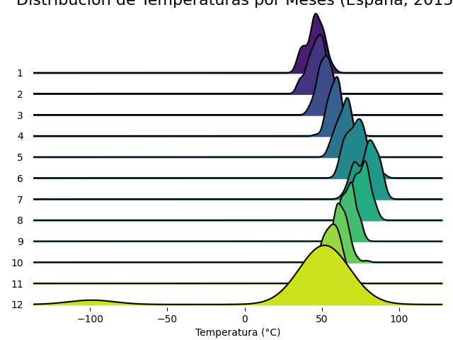
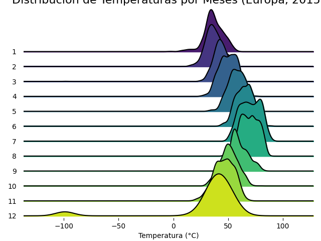
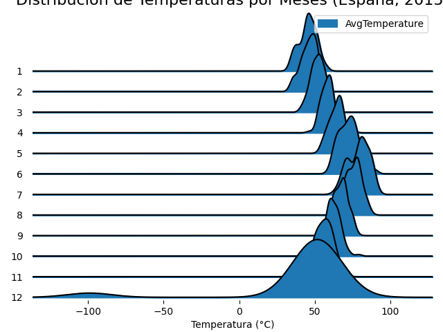
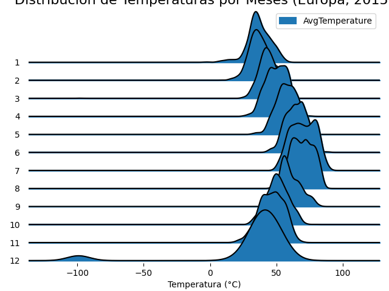

# Visualizaciones PEC2
---

## Diagrama de Red  / Network Diagram

El diagrama de red o Netowork diagram muestra relaciones entre nodos (puntos) y enlaces (líneas o aristas). Se utiliza para entender cómo están conectadas diferentes entidades o cualquier sistema de elementos interconectados. Su origen se asocia con el campo de teoría de grafos. En nuestro caso, se ha empleado para relacionar un cantante seleccionado, con el número de seguidores y popularidad con respecto a otros cantantes similares en Spotify. 

Para ver el diagrama de red, haz clic en el siguiente enlace:

[Ver Diagrama de Red](https://ouestware.gitlab.io/retina/beta/#/graph/?url=https%3A%2F%2Fgist.githubusercontent.com%2FCGD2401%2Fe453f89d756fafb3f14f968e08316e9e%2Fraw%2F59eea47e1381b8c1ca3ed788b85be6fadb47c41e%2Fnetwork-3b35c617-76c.gexf&n=7ltDVBr6mKbRvohxheJ9h1&nr=0.723&er=1.085&lt=1.38)

Este enlace llevará a un diagrama de red interactivo que se muestra en Retina.

## Bar chart / Gráfico de barras

El gráfico de barras es una de las técnicas de visualización más básicas y conocidas. Consiste en barras horizontales o verticales que representan diferentes categorías. El largo de cada barra es proporcional al valor que representa. En nuestro caso, se ha empleado para visualizar las emisiones de CO_2 de países en diferentes áreas del mundo a lo largo del tiempo.

Para ver los gráficos de barra creados, haz clic en el siguiente enlace:

[Ver Barplot Charts](Barplot.html)

Este enlace llevará a un html on los gráficos creados en Jupyter Noebook.

Las visualizaciones creadas se muestran a continuación:

Estos mísmos datos se podrían representar también con un gráfico de líneas a lo largo del tiempo:

## Ridgelin Diagram / Joyplot / Gráfico de crestas

El ridgeline chart, o Joy Division Chart, muestra múltiples distribuciones superpuestas. Se utiliza para observar tendencias y comparar distribuciones en diferentes categorías y es útil para visualizaciones que requieren mostrar la densidad de datos a través del tiempo o de múltiples categorías. En nuestro caso, se ha empleado para visualizar la temperatura registrada en España y Europa en el año 2015 y su variación a lo largo de los meses.

Para ver los gráficos de barra creados, haz clic en el siguiente enlace:

[Ver Ridgeline Charts](RidgelineChart.html)

Este enlace llevará a un html on los gráficos creados en Jupyter Noebook.

Las visualizaciones creadas se muestran a continuación:

